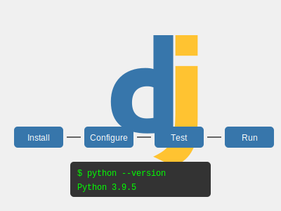
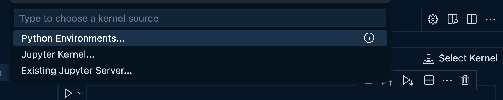
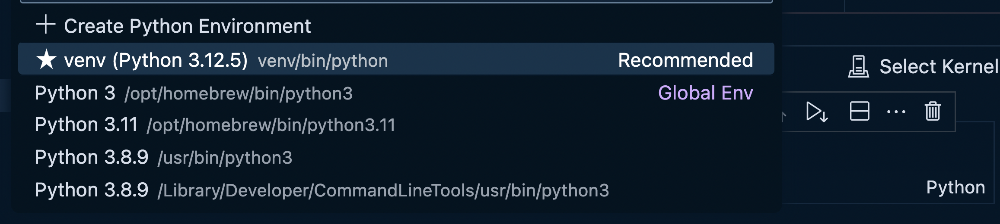
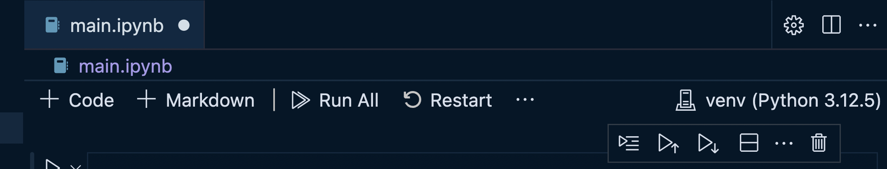
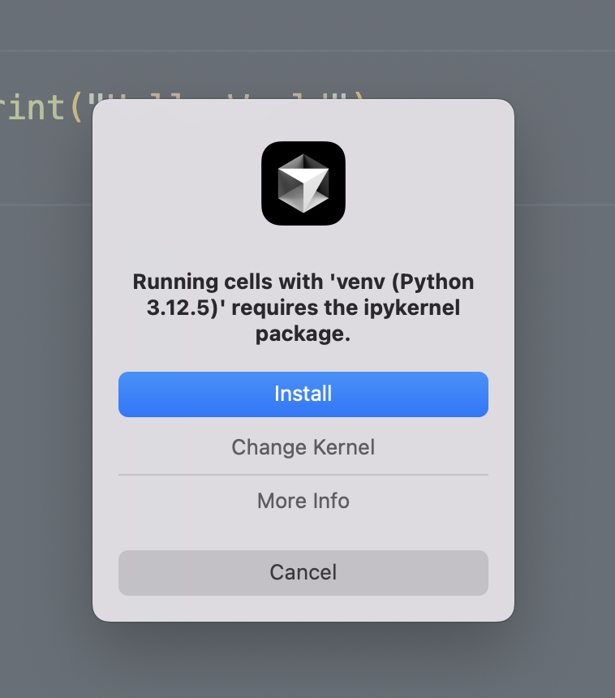

# Python Installation Guide



## 1. Install Python using Homebrew

```bash
brew install python3
```

This command uses Homebrew to install Python 3 on your macOS system. Homebrew is a package manager that simplifies the installation of software on macOS.

## 2. Verify Python and pip installation

After installation, check the versions of Python and pip:

```bash
python3 --version
pip3 --version
```

These commands will display the installed versions, confirming a successful installation.

## 3. Install Jupyter

Install Jupyter using pip:

```bash
pip3 install jupyter
```

This installs Jupyter globally, allowing you to use it across your system.

## 4. Install VSCode extensions

### Pylance

1. Open the Extensions view in VSCode (Ctrl+Shift+X).
2. Search for "Pylance" and install it.

Pylance provides enhanced language support for Python, including:

- Type checking
- Auto-imports
- Code completion
- Refactoring
- Syntax highlighting

### Jupyter

1. In the Extensions view, search for "Jupyter" and install it.

The Jupyter extension allows you to create and run Jupyter notebooks directly in VSCode.

## 4. Test the installation

To test the Python installation:

1. Open Visual Studio Code (VSCode) or your preferred code editor.
2. Create a new file named `index.py`.
3. Add the following code:

   ```python
   print("Hello Python")
   ```

4. Save the file and run it in the terminal:

   ```bash
   python3 index.py
   ```

You should see "Hello Python" printed in the terminal.

## 6. Understanding Jupyter Notebooks

Jupyter notebooks are powerful, interactive documents that combine live code, equations, visualizations, and narrative text. They offer several key features:

- **Interactive Computing**: You can write and execute code in discrete cells, seeing the results immediately below the code.
- **Rich Media Output**: Notebooks can display various types of output including text, images, HTML, LaTeX equations, and interactive plots.
- **Markdown Support**: You can include formatted text using Markdown for documentation and explanations alongside your code.
- **Language Flexibility**: While commonly used with Python, Jupyter supports many programming languages.
- **Sharable and Convertible**: Notebooks can be easily shared and converted to other formats like HTML or PDF.

Jupyter notebooks are widely used in data science, scientific computing, and education due to their ability to create and share documents that contain live code, equations, visualizations, and explanatory text.

## 7. Create a Jupyter Notebook

1. Create a new file with the `.ipynb` extension (e.g., `trial.ipynb`).
2. VSCode will open it as a Jupyter notebook.

## 8. Set up a virtual environment

For Python projects, it's recommended to use a virtual environment. This environment controls any packages you install into the workspace:

```bash
python3 -m venv venv
source venv/bin/activate
```

This creates a virtual environment named `venv` and activates it.

If you need to exit the virtual environment, you can do so by running:

```bash
deactivate
```

## 9. Working with Jupyter Notebooks

- You can add both Markdown and code cells in a Jupyter notebook.
- To add a new cell, click the "+ Code" or "+ Markdown" button.
- Execute code blocks independently by clicking the "Run" button or using Shift+Enter.

### Selecting the Correct Kernel (Environment)

When working with Jupyter notebooks, it's crucial to select the correct kernel, which corresponds to your Python environment:

1. Open your Jupyter notebook in VSCode.
2. Look for the "Select Kernel" button in the top right corner of the notebook.



3. Click on it and choose the kernel that corresponds to your `venv` environment. It should be listed as something like "Python 3.x.x ('venv': venv)" and will often have 'Rec. (Recommended)' next to it.



After you select the kernel, you should see the venv environment in the top right corner of the notebook:


4. If you don't see your `venv` environment, you may need to restart VSCode or reload the window.

Selecting the correct kernel ensures that your notebook uses the Python interpreter and packages from your virtual environment, maintaining consistency with your project setup.

**NOTE**: When you first try to run code inside a Jupyter block or when you try to choose the kernel, you will most likely receive a popup saying that you must install `ipykernel`.

Choose `Install`

   
## Additional Notes

- Jupyter notebooks are great for data analysis, visualization, and creating interactive documents.
- You can install additional Python packages within your virtual environment using `pip install <package-name>`.
- Remember to activate your virtual environment when working on your Python projects.
- VSCode's Python and Jupyter extensions provide features like IntelliSense, debugging, and code navigation, enhancing your development experience.
- Jupyter notebooks provide an excellent environment for exploratory data analysis, creating data visualizations, and developing and testing algorithms incrementally.
- The combination of code execution, rich text, and immediate output makes notebooks ideal for creating comprehensive, self-documenting pieces of analysis or research.
